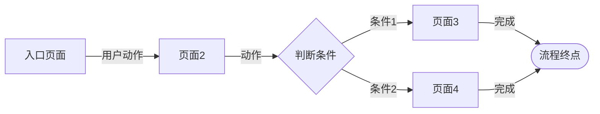

# 用户流程 - <项目名称>

> 生成时间: YYYY-MM-DD HH:MM
> Skill: page-explainer

> 本文件只描述用户流程语义。产物索引、存在性校验、一致性自查统一在 `explainer-delivery-<slug>.md`。

## 用户流程

### 流程 1: <任务名称>

**用户角色**: <角色>
**目标**: <用户要完成什么>

#### 流程图

> 使用 Mermaid flowchart 语法绘制。节点文字为「页面名」，箭头标注为「用户动作」。
> 分支用菱形节点表示判断条件，终点用圆角矩形。

#### 步骤明细

| 步骤 | 页面 | 路由 | 用户动作 | 结果 |
|------|------|------|---------|------|
| 1 | <页面名> | <路由> | <做什么> | <去哪/看到什么> |
| 2 | ... | ... | ... | ... |

### 流程 2: <任务名称>
<!-- 同上结构：流程图 + 步骤明细 -->
