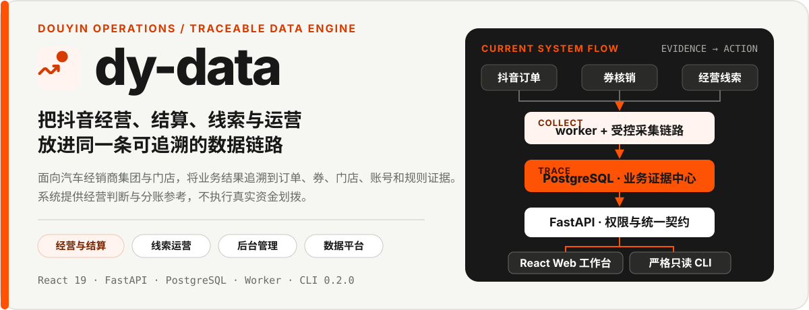

<p align="center">
  
</p>

<h1 align="center">dy-data · 抖音经营引擎</h1>

<p align="center">
  面向汽车经销商集团与门店的抖音经营数据平台。<br>
  把订单、券核销、结算、线索跟进与后台运营汇入同一套可追溯工作台。
</p>

<p align="center">
  <code>React 19</code>&nbsp;·&nbsp;<code>FastAPI</code>&nbsp;·&nbsp;<code>PostgreSQL</code>&nbsp;·&nbsp;<code>Worker</code>&nbsp;·&nbsp;<code>CLI 0.2.0</code>
</p>

<p align="center">
  <a href="./docs/项目产品介绍书.md">产品介绍</a> ·
  <a href="./docs/architecture.md">系统架构</a> ·
  <a href="./docs/runbook.md">运行手册</a> ·
  <a href="./docs/cli-agent-guide.md">Agent 调用指南</a>
</p>

## 从数据到行动

dy-data 将抖音订单、券核销、退款状态、门店与账号归属、销售表现、经营线索、跟进记录和运营规则放进同一套系统。业务结果不止停留在看板数字，还能回到订单、券、门店、账号、规则版本和任务记录复核。

> [!IMPORTANT]
> 系统提供经营判断与分账参考，不执行真实资金划拨。预计分佣比例和金额属于试运行参考，不代表最终规则或最终到账金额。

| 业务域 | 解决什么问题 | 当前承载 |
| --- | --- | --- |
| **经营与结算** | 看清销售、核销、跨店关系和月度结算参考 | 销售看板、全国门店榜单、单店结算、订单明细、异常复核 |
| **线索运营** | 把线索从查看推进到分配、跟进和审计 | 线索总览、订单详情、跟进记录、分配轮次、试运行、总部池 |
| **后台管理** | 统一账号、范围、口径和运营配置 | 账号权限、SKU 规则、商品口径、同步任务、反馈、分配规则 |
| **数据平台** | 让采集、计算、权限和部署形成稳定底座 | worker、PostgreSQL、FastAPI、React Web、Alembic、Docker Compose |

## 一条可追溯链路，两个使用入口

1. **采集**：worker 或受控脚本从抖音开放平台与浏览器导出链路获取必要数据。
2. **沉淀**：原始记录、维度映射、业务明细、汇总、线索和任务状态进入 PostgreSQL。
3. **约束**：FastAPI 按角色、门店范围、筛选条件和时间口径提供统一接口。
4. **行动**：React Web 承载经营与运营工作；CLI 为授权用户和 Agent 提供严格只读查询。

| 入口 | 适合谁 | 边界 |
| --- | --- | --- |
| **Web 工作台** | 门店经营人员、负责人、集团财务、集团管理人员和授权管理员 | 登录后按角色、页面权限与门店范围访问；管理能力由后端权限保护 |
| **只读 CLI** | 需要结构化查询的授权用户与 Agent | 继承账号数据范围；不提供业务写入；登录凭据必须由用户在安全终端或浏览器中输入 |

真实 API 是 Web 默认数据源；`VITE_USE_MOCKS=true` 仅用于显式启用的受控开发场景。页面存在不等于所有业务分支已完成用户验收，当前能力以代码、权威文档和验证记录共同为准。

## 快速开始

### 本地 Web 与测试

```powershell
python -m pip install -r requirements.txt
python -m pytest

npm --prefix apps/web install
npm --prefix apps/web run dev
```

生产构建检查：

```powershell
npm --prefix apps/web run build
```

本地配置从 `config.example.json` 复制到不提交的 `config.local.json`。配置读取优先级为：环境变量 → `DY_DATA_CONFIG` 指向的 JSON → `config.local.json` → 内置默认值。

### CLI · Agent 严格只读查询

安装后先读取运行时命令契约；这一步不需要登录：

```powershell
python -m pip install -e apps/cli
dydata commands --json
```

测试环境的一句话接入入口是 `https://dy-business-engine.com/.well-known/dydata-agent.json`。兼容远程 MCP 的 Agent 优先添加 `https://dy-business-engine.com/mcp` 并由用户在官方页面授权；需要 CLI fallback 时，安装后先运行：

```powershell
dydata agent doctor --json
```

当前 CLI 只接受命名环境 `test`，这里的测试环境明确指已部署在腾讯云、对外地址为 `https://dy-business-engine.com` 的版本，凭据按环境和服务端身份隔离。`production` 明确指未来尚未部署的企业内网服务器版本；本次不提供可用生产入口，也不把任何内网地址当成已上线地址。企业内网生产版上线时，由 DYDATA-46 一次性切换入口、OAuth issuer/resource、部署配置、凭据槽位、文档和 smoke 验证。

需要业务数据时，由用户在安全交互终端完成登录：

```powershell
dydata auth login
```

密码使用终端隐藏输入，不接受命令参数、环境变量、配置文件或管道。Agent 可以在用户明确要求后启动命令，但必须在凭据提示出现前把输入权交给用户；若当前工具不支持安全交互 TTY，使用浏览器回退：

```powershell
dydata auth login --browser
```

CLI 不会静默覆盖已有本地凭据。切换账号前先执行 `dydata auth logout`。The current named environment is the fixed test service; HTTPS is required for remote API URLs. Programmatic test injection accepts cleartext transport only as explicit loopback HTTP with a port.

继续阅读：[Agent 调用指南](./docs/cli-agent-guide.md) · [Agent CLI 使用验收](./docs/cli-agent-acceptance.md) · [自动生成的命令参考](./docs/cli-command-reference.md)

### Docker Compose 部署

`deploy/compose.yaml` 编排 PostgreSQL、迁移、API、worker、Web、浏览器和反向代理。部署前复制占位配置并替换全部 `CHANGE_ME_*`：

```bash
cp deploy/.env.example deploy/.env
docker compose --env-file deploy/.env -f deploy/compose.yaml config
docker compose --env-file deploy/.env -f deploy/compose.yaml up -d --build
```

完整迁移、健康检查、备份和恢复步骤见 [运行手册](./docs/runbook.md)。

## 技术形态

| 层次 | 当前实现 | 职责 |
| --- | --- | --- |
| 前端 | React 19、TypeScript、Vite 7 | 登录后的经营看板、业务工作台和管理后台 |
| API | Python、FastAPI、SQLAlchemy | 认证、权限、经营、结算、线索、任务和管理接口 |
| 数据 | PostgreSQL、Alembic | 原始数据、维度映射、业务明细、汇总、线索、状态与迁移 |
| 任务 | 独立 worker、受控浏览器采集 | 同步、刷新、浏览器导出和任务状态记录 |
| 交付 | Docker Compose、GitHub Actions、Nginx | 容器化部署、迁移门禁、反向代理与发布验证 |

<details>
<summary><strong>查看仓库结构</strong></summary>

```text
.agent/project-manager-suite/  公司项目治理套包安装态
apps/api/                     FastAPI 应用与业务接口
apps/cli/                     Agent-first 严格只读 CLI
apps/web/                     React / Vite Web 应用
apps/worker/                  同步、刷新和浏览器任务 worker
alembic/                      PostgreSQL 迁移
deploy/                       Docker Compose、Nginx 与部署配置
docs/                         产品、架构、设计、治理和运行文档
scripts/                      导出、结算、诊断、同步和运维脚本
src/dy_data/                  可复用 Python 领域与基础设施代码
tests/                        后端、数据、CLI、治理和回归测试
```

`mock/` 与历史脚本可用于受控开发或数据核对，但不代表当前产品只运行静态 HTML 或模拟数据。

</details>

## 文档导航

| 想了解 | 权威入口 |
| --- | --- |
| 产品定位、角色与四个业务域 | [项目产品介绍书](./docs/项目产品介绍书.md) |
| 项目级目标、范围、成功标准和风险 | [权威 BRD](./docs/brd/BRD-dy-data-20260716-1255.md) |
| 当前代码结构、服务边界和数据链路 | [系统架构](./docs/architecture.md) |
| 认证、响应包络和接口分组 | [API 契约](./docs/api-contract.md) |
| 生产部署、迁移、备份与恢复 | [运行手册](./docs/runbook.md) |
| 颜色、组件和页面视觉规范 | [V0.2 视觉系统](./docs/design-system/README.md) |
| 项目身份、当前阶段和治理状态 | [项目画像](./project-profile.md) |
| 文档 authority、evidence 与 legacy 映射 | [文档权威映射](./docs/governance/authority-map.md) |

## 安全与协作边界

- 门店账号只能访问授权门店范围；管理员能力不能只依赖前端菜单隐藏。
- 不得提交账号密码、Token、Cookie、数据库 URL、浏览器配置、真实导出数据、个人信息或个人路径。
- 金额与业务口径以后端和数据库为准；页面只负责格式化展示，不重新计算业务真相。
- GitHub 保存代码、PR、commit 与 CI 证据；需求池、范围、优先级、负责人和验收状态以 Linear `DYDATA` 团队为准。

项目协作从 [AGENTS.md](./AGENTS.md) 进入，宿主实现规则位于 [docs/rules](./docs/rules/README.md)。`/.worktrees/` 和 `/logs/` 只承载本地工作树与运行日志；可提交的开发过程日志统一写入 `docs/devlog/`。
