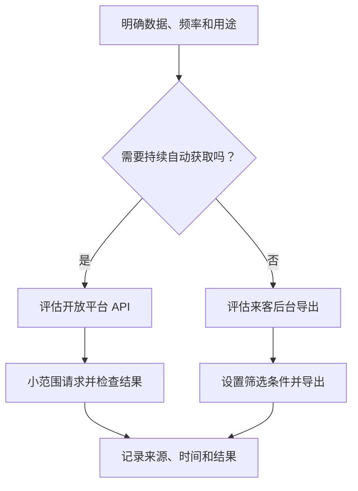

# 抖音后台有哪些数据获取方式：开放平台 API 与来客后台导出

> 适合谁：需要获取抖音业务数据，但不确定应该使用 API 还是后台导出的产品、运营和初级开发。
>
> 读完能做什么：根据用途选择取数路径，完成一次小范围 API 请求或后台导出，并检查结果是否可用。

“把抖音数据拿出来”听起来像一个动作，实际至少有两条路：开放平台 API 和来客后台导出。选错路不会马上报错，但很容易在后面吃亏。比如每天都要的数据靠人工下载，或者为了临时核对一张表，先花几天接 API。

## 先判断：你要什么数据，多久取一次

动手前先回答四个问题：

1. 要的是订单、核销、券、退款、门店、职人，还是线索？
2. 只查一次，还是每天都要更新？
3. 数据给人看，还是要进入系统继续计算？
4. 当前账号和应用是否已经有对应权限？



## 两种取数方式怎么选

| 判断维度 | 开放平台 API | 来客后台导出 |
| --- | --- | --- |
| 适合场景 | 持续同步、系统接入、重复使用 | 临时分析、人工核对、平台侧报表 |
| 前置条件 | 应用、接口权限、账号授权和开发能力 | 能登录后台，并有目标模块的查看和导出权限 |
| 首次成本 | 较高，要处理认证和接口参数 | 较低，熟悉页面后即可操作 |
| 后续成本 | 可自动运行 | 每次通常要重新筛选和下载 |
| 数据形态 | JSON 等结构化响应 | Excel、CSV 或页面生成的文件 |
| 验证重点 | 错误码、请求条件、字段和记录数 | 筛选条件、导出时间、列名和行数 |
| 主要风险 | 权限、Token、接口变化 | 登录失效、页面变化、筛选遗漏 |

一个简单判断：数据要进系统、要反复更新，优先评估 API；只为当次核对或做临时报表，后台导出通常更快。

## 常见业务数据从哪里来

下表结合抖音开放平台的生活服务能力说明和本项目当前接入整理。它是取数导航，不是平台对所有应用的权限承诺。

| 数据类型 | 常见来源 | 使用提醒 |
| --- | --- | --- |
| 订单 | 生活服务订单查询 API；来客订单相关页面 | API 需要交易相关能力；先限定创建时间 |
| 核销记录 | 券核销记录 API；来客核销报表 | 注意核销时间和订单创建时间不是同一条件 |
| 券/凭证 | 按订单查询券信息的 API | 通常先有订单号，再查券明细 |
| 退款/售后 | 售后接口或后台售后报表 | 本项目保留售后接口定义，正式使用前仍要确认当前权限和业务范围 |
| 门店 | 门店/POI 查询 API；后台门店列表 | 核对账户与门店的绑定关系 |
| 职人 | 职人绑定信息 API；后台绑定列表 | 页面或字段名称可能随平台调整 |
| 线索 | 生活服务线索 API；来客线索模块 | 涉及联系方式时必须按权限和隐私要求处理 |

抖音官方资料明确说明，生活服务能力可以覆盖商铺与商品、交易、退款和 POI 数据回流，但具体接口是否可用，仍取决于开发者类型、应用权限和账号关系。

## 路径一：用开放平台 API 跑出一小批数据

如果还没有跑通 Token，先看[《从零跑通抖音开放平台 API》](./01-douyin-open-api-first-request.md)。

下面以订单为例。目标不是拉全量，而是验证某个短时间范围内能拿到记录。

### 1. 选一个已经开通的接口

先在应用权限中确认订单查询能力，再核对接口文档的必填参数。不要只因为项目里写了接口地址，就认为当前应用一定有权调用。

### 2. 把时间范围缩小

第一次可以选一个确定有业务发生的短时间段。太长容易遇到分页，太短又可能刚好没有记录。

本项目客户端的调用方式如下：

```python
from datetime import datetime

result = client.query_orders(
    datetime(2026, 7, 1, 0, 0, 0),
    datetime(2026, 7, 2, 0, 0, 0),
    page_size=20,
    cursor="0",
)
```

日期和数据都是示例。运行时应使用有权限的测试账户和受控环境，不要把真实响应复制到知识库。

### 3. 检查响应

依次看：

- HTTP 请求是否成功；
- 业务错误码是否为成功值；
- 返回列表是否存在；
- 记录中的订单号、状态、金额和时间字段是否符合目标。

如果一页刚好等于 `page_size`，通常还要按接口返回的游标继续请求。本文只提醒到这里，不展开完整分页和补拉策略。

### 4. 保存脱敏结果

记录接口名称、账户代号、时间范围、记录数和检查结论。订单号、手机号、券码和金额示例应替换或遮盖。

## 路径二：从来客后台导出一份数据

来客后台页面会调整，不同账号看到的模块也可能不同。下面按功能描述操作，具体名称以当前来客后台为准。

### 1. 用有权限的账号登录

确认账号能看到目标数据模块，并且有导出权限。只看得到列表，不一定能下载文件。

### 2. 进入目标模块

根据要查的数据进入订单、核销、门店、职人或线索等模块。先不要导出，先在页面把结果查对。

### 3. 设置筛选条件

至少记录：

- 时间字段选的是创建时间、支付时间还是核销时间；
- 开始和结束日期；
- 门店或账号范围；
- 订单状态、核销状态等附加条件。

同一份“7 月数据”，如果选了不同时间字段，结果会完全不同。

### 4. 执行查询并观察页面结果

确认页面不是空白、账号没有掉线，结果条数也大致符合预期。如果页面已经不对，不要急着点导出。

### 5. 点击导出并等待文件生成

文件可能直接下载，也可能进入任务中心。下载完成后保留原始文件名和导出时间，便于以后说明来源。不要把登录 Cookie 或浏览器配置和文件一起分享。

### 6. 打开文件检查

先看表头，再抽查首行、中间行和末行。确认没有因为筛选、权限或下载中断只得到部分数据。

> 截图建议：来客后台筛选条件和导出入口；发布前遮盖账号、门店、金额和订单号。

本项目对后台导出采用受控浏览器流程：先尝试下载工作簿，必要时读取页面已经调用的绑定列表接口。这是项目自动化方式，不建议个人在普通浏览器里复制登录状态或接口地址。

## 拿到结果后，先做四项检查

| 检查项 | 要回答的问题 |
| --- | --- |
| 来源 | 数据来自哪个 API、哪个后台模块、哪个账号范围？ |
| 时间 | 查询的是哪个时间字段，起止时间是什么？ |
| 字段 | 订单号、状态、门店、金额等目标列是否存在？ |
| 记录数 | API 列表长度或导出行数是多少，是否明显异常？ |

这四项最好和结果一起保存。只有一个 Excel 文件，却不知道筛选条件，几天后几乎无法复核。

## 常见问题

### 页面能看，API 却提示无权限

后台账号权限和开放平台应用权限是两套检查。分别确认应用能力、账号授权和账户归属。

### API 成功但列表为空

先检查账户和时间字段，再放宽时间范围。仍为空时，用后台同条件查询做人工核对。

### 点击导出没有文件

检查登录是否失效、浏览器是否拦截下载、导出任务是否仍在生成，以及账号是否具有导出权限。

### API 与导出文件字段不同

这是常见情况。先明确业务真正需要的字段，再记录两边字段如何对应。不要只因为名称相似就直接合并。

### 导出行数比页面少

重新检查筛选条件、导出任务状态和文件格式。大文件可能被拆分，也可能需要在任务中心下载完整结果。

## 完成检查表

- [ ] 已明确数据类型、使用频率和使用人。
- [ ] 已根据用途选择 API 或后台导出。
- [ ] 已确认应用或后台账号具有相应权限。
- [ ] 查询范围足够小，并且有机会命中数据。
- [ ] 已记录来源、时间条件、字段和记录数。
- [ ] API 响应或导出文件中确实存在目标数据。
- [ ] 文件、截图和验证记录已经脱敏。

## 进阶实践：什么时候需要改成定时任务

同一种数据如果每周都要人工导出、每次都要重复清洗，或者已经用于看板和结算，就该评估定时任务。先把一次取数跑通，再设计自动化；否则只是把不确定的人工步骤放大。

## 参考资料

- [抖音开放平台：通用解决方案能力列表](https://open.douyin.com/platform/resource/docs/accession-guide/common-solution/)
- [抖音开放平台：生活服务接入方案](https://open.douyin.com/platform/resource/docs/ability/life-service-ability/scene-solution/)
- [抖音开放平台：用户类型及权限说明](https://open.douyin.com/platform/resource/docs/accession-guide/type-and-permission)
- 本项目实践：`src/dy_data/douyin_client.py`、`apps/worker/collect_once.py`、`apps/worker/browser_exports/backend_aweme.py`、`docs/architecture.md`
