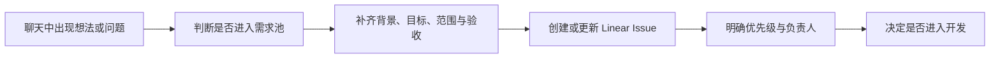

# 为什么开发协作需要 Linear：从聊天想法到统一需求池

> 适合谁：需要和产品、运营、开发或 Codex 一起推进需求的团队成员。
>
> 读完能做什么：判断一条聊天想法是否应该进入需求池，并把它整理成一条可追踪、可分工、可验收的 Linear Issue。

一个需求最初常常只有一句话：“这个筛选能不能改一下？”当时大家都懂，过两天就不一定了。谁来做、为什么做、改到什么程度，往往散在不同的聊天记录里。

聊天没有错。问题是把聊天当成了需求库。

## 聊天适合讨论，不适合长期承载需求

聊天适合快速交换信息：问一句现象、发一张截图、讨论几个方案。它不擅长长期维护下面这些内容：

- 需求当前到底是什么；
- 哪些内容确定要做，哪些明确不做；
- 谁负最终责任；
- 现在处于什么阶段；
- 达到什么条件才算完成。

多人协作后，同一个需求很容易出现三个版本：产品记得一个，开发实现了另一个，验收的人又按最早的聊天判断。

## Linear 在开发协作中承担什么角色

在“抖音经营引擎”团队中，Linear 是统一需求池和执行视图。聊天、会议、线上问题、Codex 对话都可以产生需求，但只要准备跟踪或开发，就要落到一条 Linear Issue 上。



团队中的几种载体各做各的事：

| 载体 | 适合承载 | 不适合承载 |
| --- | --- | --- |
| 聊天 | 快速讨论、补充上下文、临时提问 | 最终范围、长期状态、验收结论 |
| Linear | 需求定义、优先级、负责人、状态、验收与进度 | 很长的技术说明和大量代码 |
| 代码仓库 | 实现、测试、长期技术文档 | 需求池和业务优先级 |

一句实用的判断是：以后有人问“这件事为什么做、谁在做、做到哪了”，答案应该能从 Linear 找到。

## 一条 Issue 需要承载哪些信息

标题只能帮助搜索，不能代替需求定义。团队的通用 Issue 至少写清：

1. 背景：为什么现在提出。
2. 当前问题：具体哪里不对或低效。
3. 目标结果：完成后会发生什么变化。
4. 范围：这次改什么。
5. 不做：这次明确排除什么。
6. 涉及区域：页面、API、数据、Worker 或文档。
7. 验收标准：怎样检查完成。
8. 风险、依赖和验证计划。

如果这些信息暂时不全，可以先进入 Backlog，并标记 `Needs Definition`、`Needs Data` 或 `Needs Decision`。不确定就写不确定，别把猜测包装成结论。

## Linear 里的几个核心对象

| 对象 | 它解决的问题 | 使用提醒 |
| --- | --- | --- |
| Issue | 一件要追踪的工作是什么 | 一条 Issue 聚焦一个可验收结果 |
| Project | 这件工作属于哪项较大的目标 | Linear 当前一条 Issue 只属于一个 Project |
| 状态 | 工作真实进行到哪一步 | 状态要跟进度同步 |
| 优先级 | 先做什么、后做什么 | 紧急程度不等于声音大小 |
| 标签 | 类型、来源、模块和风险是什么 | 使用团队统一标签，避免同义词泛滥 |
| 负责人 | 谁对结果负责 | 官方规则是一条 Issue 同时只分配给一个人 |
| 评论 | 进度、阻塞和决策发生了什么 | 结论要写回描述或留下清晰评论 |

Linear 支持把工作委派给代理，但人类负责人仍保留责任。Codex 可以执行，不代表 Issue 可以没有明确负责人。

## 从一句聊天想法到统一需求池

假设运营在群里说：

> 门店月度结算的筛选不太好用，能不能优化一下？

这句话值得记录，但还不能直接进入开发。整理后的 Issue 可以写成：

```markdown
标题：优化门店月度结算筛选体验

背景：
运营每月需要按月份和门店复核结算结果。

当前问题：
当前筛选入口不够直观，切换门店后容易忘记重新确认月份。

目标结果：
运营能够明确看到当前月份和门店，并完成一次筛选。

范围：
- 调整月份和门店筛选的展示顺序。
- 切换条件后保留清晰的当前选择提示。

不做：
- 不修改结算计算规则。
- 不新增批量导出。

涉及区域：
Store Settlement、Frontend。

验收标准：
- [ ] 用户能选择月份和门店。
- [ ] 当前筛选条件始终可见。
- [ ] 切换条件后结果与选择一致。

风险 / 依赖：
需要确认现有页面截图和运营使用路径。

验证计划：
桌面端操作检查，并由一名运营同事确认。
```

这条 Issue 仍然可以讨论。区别在于，后面的讨论有了同一个落点。

## 产品、运营、开发和 Codex 如何协作

产品或业务负责人确认价值、优先级和范围取舍。运营补充真实场景、页面截图和验收反馈。开发判断影响区域、依赖和验证方式。Codex 可以整理需求、读取上下文、实施修改并回填验证记录。

责任不能因为用了工具而消失。Linear 中的负责人仍要确认方向、处理分歧，并接受最终结果。

## 什么留在聊天，什么必须回填 Linear

可以留在聊天里的内容：

- 快速问答；
- 尚未形成结论的讨论；
- 临时提醒。

必须回填 Linear 的内容：

- 范围和“不做”的变化；
- 优先级、负责人和状态；
- 会影响实现的决定；
- 阻塞、验证结果和验收结论；
- 尚未解决的风险。

如果聊天里讨论了十分钟，最后得出“这次不做批量导出”，至少把这句话写进 Issue 的“不做”。

## 常见误区

### 只有标题，没有定义

“优化筛选”无法判断做什么，也无法验收。补齐场景、目标和边界后再排期。

### 每个人都算负责人

多人参与没有问题，但一条 Issue 应有一个最终负责人。否则阻塞时没人决策。

### 只改状态，不写进展

状态变为 In Progress 只能说明开始了。关键决定、阻塞和验证证据仍要留下。

### 把 Linear 当成功能大全

团队不需要用完所有功能。先统一 Issue、Project、状态、标签、负责人和评论，就能解决大部分协作问题。

## 完成检查表

- [ ] 已判断这条想法是否值得进入需求池。
- [ ] 背景、当前问题和目标结果已经写清。
- [ ] 范围与“不做”没有互相冲突。
- [ ] 验收标准可以逐项检查。
- [ ] Project、优先级、标签和负责人已经确认。
- [ ] 聊天中的关键结论已经回填。
- [ ] 团队知道下一步是继续定义、等待排期还是进入开发。

## 进阶实践：用模板统一团队输入

Linear 的 Issue 模板可以预填状态、优先级、负责人、标签等属性，也可以把背景、范围和验收标准做成固定结构。模板的价值不是让每条需求长得一样，而是减少“忘了问”的情况。

需求进入统一池以后，还要靠真实的状态流转推进。下一篇：[《一个需求如何在 Linear 中流转》](./04-linear-issue-lifecycle.md)。

## 参考资料

- [Linear Docs：Create issues](https://linear.app/docs/creating-issues)
- [Linear Docs：Projects](https://linear.app/docs/projects)
- [Linear Docs：Issue labels](https://linear.app/docs/labels)
- [Linear Docs：Assign and delegate issues](https://linear.app/docs/assigning-issues)
- [Linear Docs：Issue templates](https://linear.app/docs/issue-templates)
- 团队文档：[Codex + Linear 协作手册](https://linear.app/keith-lim/document/codex-linear-%E5%8D%8F%E4%BD%9C%E6%89%8B%E5%86%8C-b2408c9946d6)
- 团队文档：[团队首页资源索引](https://linear.app/keith-lim/document/%E5%9B%A2%E9%98%9F%E9%A6%96%E9%A1%B5%E8%B5%84%E6%BA%90%E7%B4%A2%E5%BC%95-4812d5919d5a)
