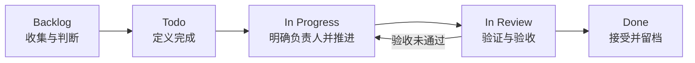

# 一个需求如何在 Linear 中流转：定义、分工、推进与验收

> 适合谁：已经开始使用 Linear，但需求仍容易卡住、失真或缺少验收证据的团队成员。
>
> 读完能做什么：推动一条 Issue 从 Backlog 进入 Todo、In Progress、In Review 和 Done，并在每个阶段留下足够记录。

创建 Issue 只是把事情放进了需求池。它是否能顺利完成，取决于后面的定义、分工、推进和验收。

这篇继续使用上一篇的例子：“优化门店月度结算筛选体验”。

## 一条 Issue 不等于一个已经定义好的需求

下面两条 Issue 看起来都在说同一件事：

- 优化结算筛选。
- 运营每月复核门店结算时容易混淆月份和门店；本次调整筛选顺序并持续显示当前条件，不改结算规则和导出功能。

第一条只能提醒大家“有件事”。第二条才有机会分工和验收。

状态也不能替代定义。把标题从 Backlog 拖到 In Progress，不会自动补出范围、负责人和验收标准。

## 先看完整生命周期



| 状态 | 核心问题 | 进入条件 | 最小输出 |
| --- | --- | --- | --- |
| Backlog | 这件事是否值得做 | 有来源和初步问题 | 背景、问题、待补信息 |
| Todo | 是否已经可以开发 | 范围、不做和验收清楚 | 优先级、负责人候选、验证计划 |
| In Progress | 谁在做，哪里受阻 | 唯一负责人开始执行 | 真实进度、决定和阻塞 |
| In Review | 结果是否满足需求 | 实现完成并提供证据 | 测试、截图或业务确认 |
| Done | 结果是否被接受 | 验收通过，风险已记录 | 最终结论和后续事项 |

## Backlog：捕获想法并判断价值

Backlog 允许不完整，但不能完全没有上下文。至少记录：

- 需求从哪里来；
- 当前看到了什么问题；
- 谁受到影响；
- 还缺哪项信息。

例子可以先写成：

```text
来源：运营月度复核反馈
问题：切换门店后，当前月份不够醒目，容易看错结果
影响：门店月度结算复核
待补：页面截图、出现频率、期望操作方式
```

如果缺截图，加 `Needs Data`；如果要决定是否调整整个页面，加 `Needs Decision`。标签是提醒，不是把缺口藏起来。

## Todo：完成定义并满足开发门槛

进入 Todo 前，要把模糊想法变成可检查的需求：

- 背景和当前问题明确；
- 目标结果能被读懂；
- 范围与“不做”没有冲突；
- 涉及模块能够定位；
- 验收标准可逐项执行；
- 权限、外部接口等风险已经标记。

本例的范围是调整月份和门店筛选的展示与提示。不做结算规则修改，也不新增批量导出。这个边界很重要，它能阻止一个小体验问题在开发中长成页面重做。

Todo 还应确认优先级和负责人。此时负责人可以是计划执行的人；真正开始时再进入 In Progress。

## In Progress：明确负责人并真实同步进度

一条 Issue 同时只有一个主要负责人。产品、运营、开发和 Codex 都能参与，但最终需要有人处理选择和阻塞。

开始前确认：

1. 没有另一个协作者同时修改同一需求。
2. 负责人已经读过范围、不做和验收标准。
3. 所需截图、数据或权限已经具备。

进度评论不需要写日报。说清做了什么、验证了什么、下一步是什么即可：

```text
进度：已完成筛选区布局调整，月份和门店条件会持续显示。
验证：桌面端选择、切换和清空路径已检查。
下一步：补充截图并请运营按月度复核路径验收。
```

遇到阻塞时也要具体：

```text
阻塞：运营截图中的页面与当前测试环境版本不同，暂时无法确认筛选入口位置。
需要：请提供当前页面地址或重新截取完整筛选区域。
影响：暂停界面调整，不影响已完成的需求定义。
```

“处理中”几乎没有信息。写清需要谁做什么，协作才会继续。

## In Review：用证据支持验收

In Review 表示实现方认为工作已经完成，正在等待检查。它不是“先放这里，之后再说”。

验证材料按任务选择：

- 界面变化：操作截图、关键路径检查、业务人员确认；
- API 或 Worker：对应测试、任务记录和必要日志；
- 数据相关：样本、查询或导出对比；
- 生产变更：部署结果、线上检查和回退说明。

不要求每条 Issue 同时提供所有材料。本例是筛选体验调整，最有用的是修改前后截图、一次完整操作记录，以及运营按原场景复核后的结论。

验收标准逐项写结果：

```text
验收记录
- 选择月份和门店：通过
- 当前筛选条件持续可见：通过
- 切换条件后结果与选择一致：通过
- 运营月度复核路径：待确认
```

最后一项没确认，就不能把整条需求说成已经验收。

## Done：被接受后再关闭

进入 Done 前，至少确认四件事：

1. 实现已经提交，或者明确记录这项工作不需要代码修改。
2. 验证命令与结果已经回填。
3. 负责验收的人接受了结果。
4. 剩余风险已说明，超出范围的问题已拆成后续 Issue。

测试通过只能证明相应检查通过，不自动代表业务方接受。反过来，业务方觉得“看起来可以”也不能替代必要的技术验证。

## 需求变化或验收未通过时怎么办

小变化可以直接更新原 Issue，例如把“当前月份高亮”补成更具体的验收描述。更新后在评论里说明原因，避免协作者只看到新版本。

如果变化已经超出原目标，例如突然要求新增批量导出，就创建后续 Issue。原需求继续按原范围验收，新需求重新判断优先级和风险。

验收未通过时，把状态退回 In Progress，并写清失败项、复现步骤和期望结果。不要新开一条没有关联的重复事项。

## 用一个案例走完整个流程

| 阶段 | “优化门店月度结算筛选体验”发生了什么 |
| --- | --- |
| Backlog | 记录运营反馈，补页面截图和使用场景 |
| Todo | 确认只调整筛选展示，不改计算和导出 |
| In Progress | 唯一负责人实施，评论记录进度与阻塞 |
| In Review | 提供截图和操作结果，等待运营确认 |
| Done | 验收通过；批量导出另建 Issue |

同一条 Issue 从头走到尾，后来的人才能看到需求怎样变化、为什么完成。

## 常见误区

### 先开发，之后再补定义

结果往往是实现方和验收方各自理解了一版。先写清范围和验收，通常比返工快。

### 多人参与，就没人负最终责任

协作者可以很多，负责人仍应唯一。需要换人时，更新负责人并留下交接说明。

### 状态很勤快，记录很空

频繁拖动卡片不等于同步。重要决定和阻塞必须能在 Issue 中找到。

### 验收时临时增加要求

先判断它是原验收标准的澄清，还是新范围。新范围应重新进入需求池。

## 完成检查表

- [ ] Backlog 中记录了来源、问题和待补信息。
- [ ] Todo 中的范围、不做和验收标准可以执行。
- [ ] In Progress 只有一个主要负责人。
- [ ] 进度、阻塞和重要决定已经记录。
- [ ] In Review 提供了与任务匹配的验证证据。
- [ ] 验收未通过的项目已经返回处理。
- [ ] Done 前已取得负责方确认。
- [ ] 剩余风险已经记录或拆成后续 Issue。

## 进阶实践：把剩余风险拆成后续 Issue

不要为了让当前 Issue 看起来完整，把所有遗留问题塞进评论最后一行。只要它需要单独排期、负责人或验收，就创建关联 Issue，并写清与原需求的关系。

如果还不熟悉统一需求池的分工，可先看[《为什么开发协作需要 Linear》](./03-linear-development-collaboration.md)。

## 参考资料

- [Linear Docs：Create issues](https://linear.app/docs/creating-issues)
- [Linear Docs：Edit issues](https://linear.app/docs/editing-issues)
- [Linear Docs：Assign and delegate issues](https://linear.app/docs/assigning-issues)
- [Linear Docs：Issue templates](https://linear.app/docs/issue-templates)
- 团队文档：[Codex + Linear 协作手册](https://linear.app/keith-lim/document/codex-linear-%E5%8D%8F%E4%BD%9C%E6%89%8B%E5%86%8C-b2408c9946d6)
- 团队文档：[Issue 模板与验收规范](https://linear.app/keith-lim/document/issue-%E6%A8%A1%E6%9D%BF%E4%B8%8E%E9%AA%8C%E6%94%B6%E8%A7%84%E8%8C%83-6e23d3fcb575)
