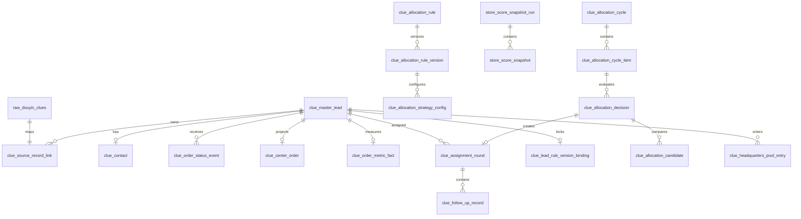

# Database Schema - 线索中心 V1.0

> 生成时间: 2026-07-21
> 来源: foundation-builder Phase 3
> 业务基线: [BRD](../../brd/BRD-clue-center-20260721-2134.md) · [术语表](foundation-glossary-clue-center.md)
> 下游产物: API 规格将在 Phase 4 确认后回填

---

## 1. 设计边界

### 1.1 数据职责

| 数据层 | 权威职责 | 可否改写历史 |
|--------|----------|--------------|
| 原始证据 | 保存抖音线索、订单、核销、退款等接口原文和采集批次 | 否，只追加或按源记录幂等覆盖 |
| 业务事实 | 保存唯一主线索、订单状态事件、指标事实和联系方式 | 状态可前推，历史事件不可改写 |
| 分配账本 | 保存规则版本、评分、候选、决策、真实轮次、跟进记录和总部池历史 | 否，纠错通过新事件或软删除记录留痕 |
| 查询投影 | 为线索看板、明细和详情提供低延迟聚合结果 | 是，可从前三层完整重建 |
| 操作审计 | 保存敏感读取、导出、发布、试运行、重建和删除动作 | 否，只追加 |

`clue_center_order` 仅是查询投影，不再承担明文手机号、订单终态或分配状态的事实来源。试运行可以写入批次、决策和候选证据，但不得创建正式轮次、改变池位置或污染经营指标。

### 1.2 PostgreSQL 物理约定

项目实际使用 PostgreSQL。本规格沿用公司建表规范的语义，并作如下物理映射：

- `bigint unsigned auto_increment` 映射为 `bigint generated by default as identity`，必要时增加 `CHECK (id > 0)`。
- `datetime` 映射为 `timestamptz`；业务日期使用 `date`。
- `tinyint unsigned` 映射为 `smallint`，布尔字段统一命名 `is_xxx` 并限制为 `0/1`。
- `json` 映射为 `jsonb`；JSON 只保存不可预知的上下文，不替代需要筛选、排序或审计的结构化列。
- 所有新表使用单数、小写下划线名称，包含 `id`、`gmt_create`、`gmt_modified`。
- 不创建数据库外键或级联；所有跨表字段均为逻辑引用，由事务、服务校验和一致性任务保证。
- 小数统一使用 `decimal`，距离单位统一为公里，时间统一存 UTC 并由前端按用户时区展示。

### 1.3 业务键与并发原则

- `order_id` 是完整主池和总体核销率的唯一去重键；缺失 `order_id` 的源记录仍保留并建立源记录映射，但 `is_complete_pool=0`，不创建轮次、不进入经营指标。
- `lead_key` 是内部稳定业务键；一条 `lead_key` 最多关联一个 `order_id`，一个非空 `order_id` 最多对应一条主线索。
- 策略步骤不等于业务轮次。只有正式决策实际选中门店时才创建 `clue_assignment_round`，`round_no` 从 1 连续递增。
- 同一主线索任一时刻最多一个活动轮次、一个活动总部池条目；终态事件拥有最高迁移优先级。
- 幂等入口分别使用源记录键、事件键、跟进幂等键、批次明细唯一键和决策业务键。

---

## 2. 全表总览

| # | 表名 | 业务域 | 来源 | 作用 | 变更 |
|---|------|--------|------|------|------|
| 1 | `raw_douyin_refund_record` | 原始证据 | 自建 | 保存退款接口原始记录，补齐退款终态证据 | **新增** |
| 2 | `clue_master_lead` | 主池 | 现有表重构 | 唯一主线索、生命周期、池位置和锚点事实 | **变更** |
| 3 | `clue_source_record_link` | 主池 | 自建 | 将每条原始线索记录映射到主线索 | **新增** |
| 4 | `clue_contact` | 主池 | 自建 | 集中保存明文/脱敏联系方式及解密状态 | **新增** |
| 5 | `clue_order_status_event` | 状态事实 | 现有表重构 | 保存订单状态的不可变事件流 | **变更** |
| 6 | `clue_center_order` | 查询投影 | 现有表重构 | 为看板、明细和详情提供订单粒度投影 | **变更** |
| 7 | `clue_order_metric_fact` | 经营指标 | 自建 | 固化完整主池、成熟窗口和核销指标事实 | **新增** |
| 8 | `clue_assignment_round` | 跟进责任 | 现有表重构 | 保存实际分配给门店的连续责任轮次 | **变更** |
| 9 | `clue_follow_up_record` | 跟进行为 | 现有表重构 | 保存五类跟进动作及软删除审计字段 | **变更** |
| 10 | `clue_store_group` | 规则范围 | 现有表重构 | 定义可复用门店组 | **变更** |
| 11 | `clue_store_group_member` | 规则范围 | 现有表重构 | 保存门店组成员历史 | **变更** |
| 12 | `clue_allocation_rule` | 规则配置 | 现有表重构 | 定义全局/城市/门店组/锚点门店规则身份 | **变更** |
| 13 | `clue_allocation_rule_version` | 规则配置 | 现有表重构 | 保存不可变的草稿、发布和退役版本 | **变更** |
| 14 | `clue_allocation_strategy_config` | 规则配置 | 现有表重构 | 保存三类固定策略的启停、顺序和参数 | **变更** |
| 15 | `clue_lead_rule_version_binding` | 规则配置 | 现有表重构 | 锁定主线索首次正式分配命中的规则版本 | **变更** |
| 16 | `store_score_snapshot_run` | 门店评分 | 现有表重构 | 保存一次评分计算的窗口和公式版本 | **变更** |
| 17 | `store_score_snapshot` | 门店评分 | 现有表重构 | 保存每店不可变评分证据 | **变更** |
| 18 | `clue_allocation_cycle` | 分配运行 | 现有表重构 | 保存试运行、正式运行和重建批次 | **变更** |
| 19 | `clue_allocation_cycle_item` | 分配运行 | 自建 | 保存批次内每条线索的执行结果 | **新增** |
| 20 | `clue_allocation_decision` | 分配决策 | 现有表重构 | 保存每个策略步骤的不可变决策摘要 | **变更** |
| 21 | `clue_allocation_candidate` | 分配决策 | 自建 | 结构化保存每个候选门店的资格、距离与评分 | **新增** |
| 22 | `clue_headquarters_pool_entry` | 总部池 | 现有表重构 | 保存总部池进入、关闭和来源证据 | **变更** |
| 23 | `clue_operation_audit_log` | 安全审计 | 现有表扩展重构 | 统一记录敏感读取和高风险管理动作 | **变更** |

### 2.1 上游共享表（只读引用，不在本次改名）

| 现有物理表 | 本域消费字段 | 使用方式 |
|------------|--------------|----------|
| `raw_douyin_clues` | 源行键、线索/订单、`follow_poi_id`、联系方式、商品、场景、状态和原文 | 只读，主池物化输入 |
| `raw_douyin_orders` | 订单号、下单时间、销售店、订单状态、商品和金额 | 只读，订单与销售店事实 |
| `raw_douyin_order_coupons` | 券状态、退款金额和退款时间 | 只读，退款补充证据 |
| `raw_douyin_verify_records` | 订单/券、核销门店和核销时间 | 只读，核销终态证据 |
| `dim_stores` | 门店身份、可服务状态、省市和经纬度 | 只读，候选与展示 |
| `dim_store_poi_mappings` | `follow_poi_id` 到内部门店映射 | 只读，唯一锚点映射 |
| `dim_sku_product_rules` | SKU 到商品类型映射 | 只读，商品分类 |
| `users`、`user_store_scopes` | 用户角色、状态和门店数据范围 | 只读，服务端授权 |
| `job_runs`、`sync_settings` | 采集、物化和调度运行信息 | 只读，运行治理 |

现有共享表沿用当前名称属于跨业务域兼容边界，不作为新建表命名范例。若未来治理这些共享表，应另立迁移需求，避免在线索中心改造中扩大范围。

---

## 3. 单表定义索引

### 3.1 原始证据与主池

| 表 | 字段数 | 索引数 | 完整定义 |
|----|--------|--------|----------|
| `raw_douyin_refund_record` | 16 | 4 | [查看](foundation-schema-clue-center/raw_douyin_refund_record.md) |
| `clue_master_lead` | 34 | 8 | [查看](foundation-schema-clue-center/clue_master_lead.md) |
| `clue_source_record_link` | 18 | 5 | [查看](foundation-schema-clue-center/clue_source_record_link.md) |
| `clue_contact` | 16 | 4 | [查看](foundation-schema-clue-center/clue_contact.md) |
| `clue_order_status_event` | 18 | 5 | [查看](foundation-schema-clue-center/clue_order_status_event.md) |
| `clue_center_order` | 36 | 9 | [查看](foundation-schema-clue-center/clue_center_order.md) |
| `clue_order_metric_fact` | 23 | 6 | [查看](foundation-schema-clue-center/clue_order_metric_fact.md) |

### 3.2 跟进责任与行为

| 表 | 字段数 | 索引数 | 完整定义 |
|----|--------|--------|----------|
| `clue_assignment_round` | 39 | 11 | [查看](foundation-schema-clue-center/clue_assignment_round.md) |
| `clue_follow_up_record` | 24 | 7 | [查看](foundation-schema-clue-center/clue_follow_up_record.md) |

### 3.3 规则、评分与运行

| 表 | 字段数 | 索引数 | 完整定义 |
|----|--------|--------|----------|
| `clue_store_group` | 9 | 3 | [查看](foundation-schema-clue-center/clue_store_group.md) |
| `clue_store_group_member` | 11 | 4 | [查看](foundation-schema-clue-center/clue_store_group_member.md) |
| `clue_allocation_rule` | 15 | 5 | [查看](foundation-schema-clue-center/clue_allocation_rule.md) |
| `clue_allocation_rule_version` | 23 | 6 | [查看](foundation-schema-clue-center/clue_allocation_rule_version.md) |
| `clue_allocation_strategy_config` | 14 | 5 | [查看](foundation-schema-clue-center/clue_allocation_strategy_config.md) |
| `clue_lead_rule_version_binding` | 15 | 5 | [查看](foundation-schema-clue-center/clue_lead_rule_version_binding.md) |
| `store_score_snapshot_run` | 18 | 5 | [查看](foundation-schema-clue-center/store_score_snapshot_run.md) |
| `store_score_snapshot` | 28 | 7 | [查看](foundation-schema-clue-center/store_score_snapshot.md) |
| `clue_allocation_cycle` | 27 | 7 | [查看](foundation-schema-clue-center/clue_allocation_cycle.md) |
| `clue_allocation_cycle_item` | 21 | 6 | [查看](foundation-schema-clue-center/clue_allocation_cycle_item.md) |
| `clue_allocation_decision` | 29 | 8 | [查看](foundation-schema-clue-center/clue_allocation_decision.md) |
| `clue_allocation_candidate` | 28 | 8 | [查看](foundation-schema-clue-center/clue_allocation_candidate.md) |
| `clue_headquarters_pool_entry` | 25 | 8 | [查看](foundation-schema-clue-center/clue_headquarters_pool_entry.md) |
| `clue_operation_audit_log` | 26 | 8 | [查看](foundation-schema-clue-center/clue_operation_audit_log.md) |

---

## 4. 关系总图

图中连线均为逻辑关系，不代表数据库外键。跨表写入必须在同一服务事务中完成，并由离线一致性检查验证孤儿引用、重复活动轮次和重复活动总部池条目。

---

## 5. 状态分层

| 状态维度 | 权威表.字段 | 允许值摘要 | 不得替代的概念 |
|----------|-------------|------------|----------------|
| 订单状态 | `clue_master_lead.normalized_order_status` | 未知、可促核销、已核销、已退款 | 轮次是否可操作 |
| 生命周期 | `clue_master_lead.lifecycle_status` | 源记录隔离、活跃、核销关闭、退款关闭 | 当前池位置 |
| 池位置 | `clue_master_lead.pool_location` | 无、待分配、门店跟进池、总部池、关闭 | 分配批次执行状态 |
| 批次状态 | `clue_allocation_cycle.cycle_status` | 待执行、运行中、完成、部分失败、失败、取消 | 线索业务状态 |
| 轮次状态 | `clue_assignment_round.round_status` | 两类活动态、七类关闭态 | 店端展示文案 |
| 店端状态 | `clue_center_order.store_display_status` | 待跟进、已跟进、超期失效、主动战败、已核销、已退款 | 后台事实字段 |
| 总部池状态 | `clue_headquarters_pool_entry.entry_status` | 活动、关闭 | 订单终态 |

终态迁移优先级固定为：`已核销/已退款 > 战败/换店 > SLA/保护期到期`。并发消费者必须先锁定主线索和当前活动轮次，再比较事件优先级及 `state_version`；重复事件以业务幂等键返回已处理结果。

---

## 6. 页面字段追踪

| 页面/能力 | 主要读取表 | 主要写入表 |
|-----------|------------|------------|
| 线索看板 | `clue_order_metric_fact`、`clue_center_order`、`clue_assignment_round` | 无 |
| 线索明细 | `clue_center_order`、`clue_assignment_round` | 无 |
| 线索跟进详情 | `clue_center_order`、`clue_contact`、`clue_assignment_round`、`clue_follow_up_record` | `clue_follow_up_record`、`clue_assignment_round` |
| 查看/复制完整号码 | `clue_contact`、当前活动 `clue_assignment_round`、用户范围表 | `clue_operation_audit_log` |
| 线索/订单导出 | 查询投影、联系方式及账号范围 | `clue_operation_audit_log` |
| 分配规则 | `clue_allocation_rule`、版本、策略配置、门店组 | 规则、版本、策略配置、审计 |
| 分配试运行 | 规则版本、评分快照、批次、明细、决策、候选 | 试运行批次、明细、决策、候选、审计 |
| 正式分配/再分配 | 主线索、规则绑定、评分、历史轮次 | 批次、明细、决策、候选、轮次、总部池、审计 |
| 分配记录 | 批次、明细、决策、候选、轮次 | 无 |
| 总部池 | 主线索、总部池条目、查询投影 | 当前 V1 无业务写操作 |
| 经营效果 | `clue_order_metric_fact`、评分运行和评分快照 | 指标物化任务更新事实表 |

---

## 7. 一次性迁移与删除映射

| 现有结构 | 目标处理 | 原因 |
|----------|----------|------|
| `clue_master_leads` | 迁移为 `clue_master_lead`；源行键拆到链接表；删除 `allocation_state` | 分离主线索、源记录和执行状态 |
| `clue_order_status_events` | 迁移为 `clue_order_status_event` 并补充来源证据 | 建立不可变终态事件流 |
| `clue_center_orders` | 迁移为读模型 `clue_center_order`；明文手机号移出 | 避免投影成为事实源和敏感数据散落 |
| `clue_assignment_rounds` | 仅迁移正式新引擎轮次；删除 `execution_mode=legacy` 数据与字段 | 项目未生产，不保留旧引擎兼容或双写 |
| `clue_follow_up_records` | 迁移为 `clue_follow_up_record` 并补幂等键、动作枚举和软删除约束 | 稳定动作流水和删除审计 |
| 规则、门店组、评分相关复数表 | 一次迁移到同名语义的单数目标表 | 统一公司命名、主键和逻辑关系规范 |
| `clue_allocation_cycles.selected_lead_keys` | 拆为 `clue_allocation_cycle_item` | 支持分页、重试、逐线索结果和审计 |
| `clue_allocation_decisions.decision_snapshot` 等候选 JSON | 候选拆为 `clue_allocation_candidate`；决策仅保留上下文摘要 | 支持稳定查询、解释和测试 |
| `clue_allocation_audit_logs` | 迁移并扩展为 `clue_operation_audit_log` | 同一审计模型覆盖联系方式和高风险操作 |
| 旧物化器和 `legacy` 分配路径 | DYDATA-34 中删除，不建立兼容视图或双写 | 确保唯一自有分配引擎 |

迁移顺序固定为：建立目标表和约束 → 迁移共享事实与新引擎正式数据 → 对账主池/轮次/总部池/手机号 → 切换读取与任务 → 删除旧路径及旧表。任何一步对账失败都不得进入下一步；不使用静默回退到旧引擎的方案。

---

## 8. Schema 验收约束

1. 每条 `raw_douyin_clues` 源记录必须有且只有一条 `clue_source_record_link`；缺订单记录映射到隔离主线索，不得静默丢弃。
2. 每个非空 `order_id` 只对应一条完整主池事实；总体核销率按订单下单月和唯一订单计算。
3. 终态订单保留主记录且无活动轮次、无活动总部池条目；首次采集已终态不创建轮次。
4. 每条活跃线索最终处于待分配受控态、门店跟进池或总部池之一；正式批次完成后不得长期停留在待分配。
5. 同一主线索最多一个活动轮次，真实轮次号连续；试运行和跳过策略不得创建轮次。
6. 规则版本、评分、候选和决策证据不可被后续配置或评分计算改写。
7. 跟进动作只有五类；首次保护动作只设置一次保护期，战败/换店即时关闭，终态事件优先。
8. 明文手机号只存在 `clue_contact`；查询投影、日志、异常和普通列表不得包含明文。
9. 总部池不进入任何门店指标分母；经营效果事实必须保留 2026 年 1 至 6 月基线、过渡月和 30 天成熟窗口所需字段。
10. 目标表不使用数据库外键或级联；孤儿引用、重复活动态和事实投影偏差必须有自动一致性检查。

---

## 9. 待 Phase 4 回填

- 每张表对应的读写接口、请求字段和响应字段。
- 服务端权限校验点、错误码和幂等响应。
- 状态迁移接口与定时任务之间的事务边界。
- 导出、手机号读取和高风险管理操作的审计事件映射。

本文件经用户确认后方可进入 FOUNDATION Phase 4 API 设计。
