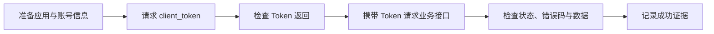
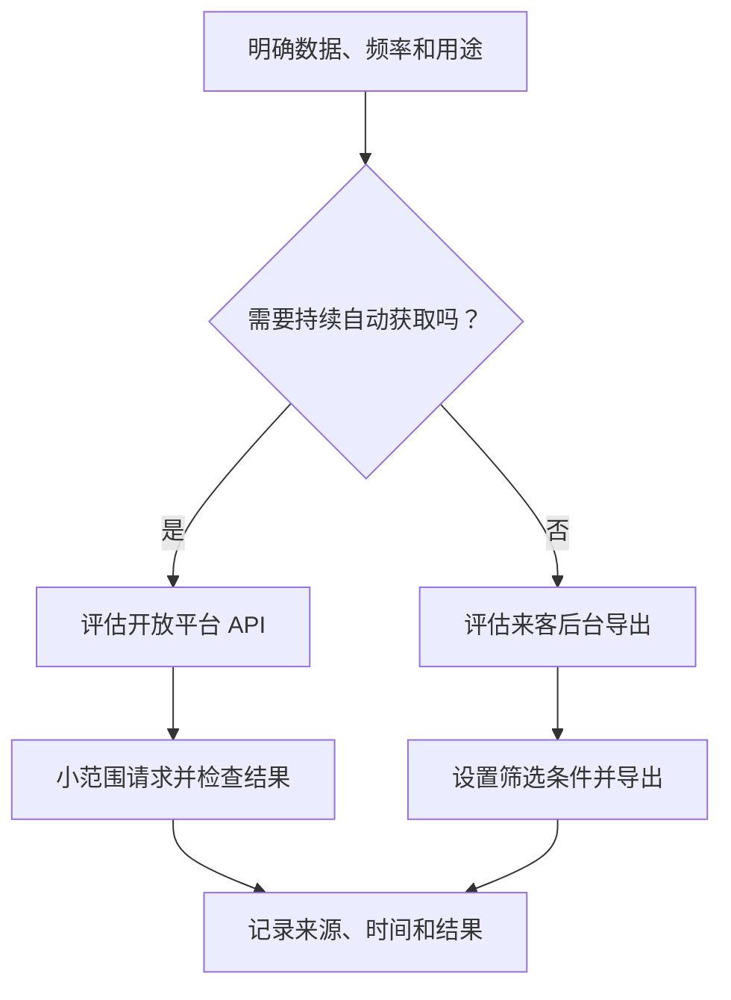
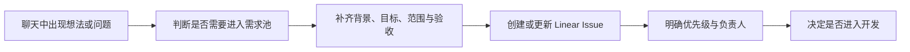
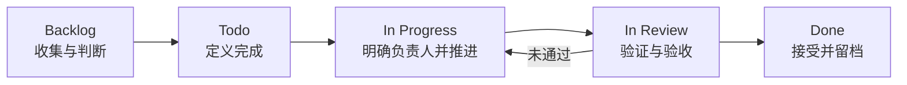

# DYDATA-51：抖音数据获取与 Linear 开发协作知识库文章设计

## 文档信息

- Linear：DYDATA-51
- 状态：目录与写作方案已确认，待按本文拆解撰写
- 目标读者：产品、运营、初级开发
- 输出形式：适合公司知识库发布的独立 Markdown 文章
- 写作原则：少代码、多步骤、多示意图；先讲清楚“为什么”和“怎么做”，再补充必要的技术细节

## 一、背景与目标

项目开发过程中已经沉淀出两类值得复用的经验：

1. 如何从抖音侧获得业务数据，包括开放平台 API 和来客后台导出。
2. 如何让多人开发需求从聊天中的想法，进入 Linear 并完成定义、推进与验收。

本次将这些经验整理为四篇短文章。每篇文章解决一个明确问题，能够独立阅读，也能按照“先获取数据、再开展协作”的顺序组成系列。

文章不以展示项目代码为目标，而是帮助第一次接触相关工作的同事建立正确路径、完成一次可验证的操作，并知道遇到问题时应该从哪里排查。

## 二、已确认的范围

### 2.1 文章清单

1. 《从零跑通抖音开放平台 API：准备、Token 与第一次请求》
2. 《抖音后台有哪些数据获取方式：开放平台 API 与来客后台导出》
3. 《为什么开发协作需要 Linear：从聊天想法到统一需求池》
4. 《一个需求如何在 Linear 中流转：定义、分工、推进与验收》

### 2.2 明确不写

- 不单独展开分页、时间窗、补拉和完整数据同步策略。
- 不写前后端联调、真实回读、数据口径或质量门禁。
- 不写 Git 分支、代码交接或多人开发的技术实现细节。
- 不写“如何撰写技术文章”。
- 不深入介绍 FastAPI、React、pytest、Docker 或 CI。
- 不使用真实密钥、Cookie、账号、手机号、生产域名、数据库地址或原始导出数据。

## 三、系列结构

四篇文章分为两个小系列：

| 小系列 | 文章 | 读者完成后能够做到 |
| --- | --- | --- |
| 抖音数据获取 | 第一篇、第二篇 | 理解两种常用取数方式，并完成一次小范围、可验证的数据获取 |
| Linear 开发协作 | 第三篇、第四篇 | 把聊天中的需求沉淀为统一事项，并推动它完成定义、分工和验收 |

每篇文章均采用以下基础结构：

1. 这篇文章解决什么问题。
2. 开始之前需要准备什么。
3. 用一张图说明完整流程。
4. 按步骤完成一次操作。
5. 如何判断操作成功。
6. 常见问题与处理建议。
7. 完成检查清单。
8. 进阶实践，仅放置目标读者确实需要的补充信息。

正文以通俗说明为主。代码示例只保留完成操作所需的最小片段，并逐项解释输入、输出和风险。

## 四、第一篇设计

### 《从零跑通抖音开放平台 API：准备、Token 与第一次请求》

### 4.1 读者问题

读者知道抖音存在开放平台 API，但不清楚应用凭证、账号标识、Token 和业务接口之间的关系，也不知道怎样验证第一次请求是否真正成功。

### 4.2 目标结果

读者完成文章后能够：

- 分清 `app_id`、`app_secret`、`account_id` 和 `access_token` 的用途。
- 在不泄露凭证的前提下准备请求参数。
- 获取一次 Token，并发起一次最小业务请求。
- 从 HTTP 状态、业务错误码和返回数据三个层面判断请求结果。

### 4.3 推荐目录

1. 为什么不能直接调用业务接口
2. 调用 API 前需要准备的四样东西
3. `app_id`、`app_secret`、`account_id` 与 Token 的关系
4. 第一步：安全保存应用凭证
5. 第二步：请求 `client_token`
6. 第三步：把 Token 放进业务请求
7. 第四步：发起第一次小范围请求
8. 怎样判断“接口已跑通”
9. 常见失败：凭证错误、权限不足、Token 失效、账号不匹配
10. 完成检查清单
11. 进阶实践：项目中如何复用 Token 和保护敏感信息

### 4.4 流程图设计

图中控制在六个节点以内：



### 4.5 示例策略

- 使用 `APP_ID_EXAMPLE`、`APP_SECRET_EXAMPLE`、`ACCOUNT_ID_EXAMPLE` 和 `TOKEN_EXAMPLE`。
- 只展示一个最小请求示例，并用中文解释请求地址、请求头、请求体和返回字段。
- 业务请求采用较小时间范围和较小返回数量，避免让“第一次跑通”演变为批量采集教程。
- 示例响应仅保留与判断成功有关的字段，数据内容全部虚构。

### 4.6 事实依据

- 抖音开放平台当期官方文档：认证方式、Token 接口、请求头和错误码。
- 项目实现：`src/dy_data/douyin_client.py`。
- 项目配置说明：`src/dy_data/config.py`。
- 项目运行说明：`docs/runbook.md`。

正式撰写时必须重新核对官方文档，不凭记忆填写菜单名称、权限名称、接口路径或有效期。

### 4.7 篇幅与验收

- 建议 2200—3000 字。
- 至少包含一张流程图、一段最小请求示例、一段脱敏返回示例和一份完成检查清单。
- 不承诺“获得 Token 就能访问全部数据”，必须明确应用权限和账号授权仍会影响结果。

## 五、第二篇设计

### 《抖音后台有哪些数据获取方式：开放平台 API 与来客后台导出》

### 5.1 读者问题

面对“把抖音后台数据拿出来”这一需求，读者容易直接选择某一种工具，却没有先判断数据类型、使用频率、权限条件和交付形式，最终出现拿不到数据、字段不合适或流程无法重复的问题。

### 5.2 目标结果

读者完成文章后能够：

- 理解开放平台 API 与来客后台导出的差异。
- 根据数据类型、频率和使用场景选择取数方式。
- 分别跑出一次小范围 API 数据和一次后台导出文件。
- 对返回或导出结果做基础检查。

### 5.3 推荐目录

1. “获取抖音数据”其实有两条常见路径
2. 先判断要什么数据、多久取一次、给谁使用
3. 开放平台 API：适合持续、结构化、可自动化的取数
4. 来客后台导出：适合人工确认、临时分析和平台侧报表
5. 两种方式的选择对照表
6. 路径一：用 API 跑出一小批数据
7. 路径二：从来客后台导出一份文件
8. 如何检查“拿到的数据可以使用”
9. 常见情况：无权限、无数据、字段不一致、导出失败
10. 完成检查清单
11. 进阶实践：什么时候需要把一次性操作改成定时任务

### 5.4 选择对照表

正文至少覆盖以下比较维度：

| 判断维度 | 开放平台 API | 来客后台导出 |
| --- | --- | --- |
| 适合场景 | 持续同步、系统接入、重复使用 | 临时分析、人工核对、平台报表 |
| 前置条件 | 应用、权限、授权和开发能力 | 可登录后台且具有对应页面权限 |
| 操作成本 | 首次接入较高，后续可自动化 | 首次较低，重复导出依赖人工 |
| 数据形态 | 结构化响应 | 表格文件或页面导出结果 |
| 验证重点 | 状态、错误码、字段、记录数 | 筛选条件、时间范围、列名、行数 |
| 主要风险 | 权限、Token、接口变更 | 登录状态、页面变化、筛选条件遗漏 |

### 5.5 流程图设计



### 5.6 操作颗粒度

API 路径沿用第一篇已经解释的认证概念，只简要引用，不重复完整 Token 教程。重点展示：

- 选择一个有权限的数据接口。
- 设置小时间范围或少量记录。
- 发起请求。
- 检查记录数、关键字段和查询条件。

来客后台路径按“登录—进入模块—设置筛选—执行查询—导出—检查文件”的顺序编写。页面名称和按钮名称必须以实际可访问环境或官方说明为准；无法确认的界面细节不得编造。

### 5.7 事实依据

- 抖音开放平台和抖音来客当期官方说明。
- 项目采集实现：`src/dy_data/douyin_client.py`。
- 项目单次采集入口：`apps/worker/collect_once.py`。
- 项目后台导出实现：`apps/worker/browser_exports/backend_aweme.py`。
- 项目架构说明：`docs/architecture.md`。

### 5.8 篇幅与验收

- 建议 2500—3500 字。
- 至少包含一张选择流程图、一张方式对照表、两套操作步骤和一份结果检查清单。
- 只介绍跑出数据所需的最小概念，不展开分页、补拉、去重和调度实现。

## 六、第三篇设计

### 《为什么开发协作需要 Linear：从聊天想法到统一需求池》

### 6.1 读者问题

多人协作时，想法常散落在聊天、会议或个人笔记中。团队容易遇到需求找不到、优先级不一致、责任人不清楚、完成标准不同等问题。

### 6.2 目标结果

读者完成文章后能够：

- 理解 Linear 在开发协作中的角色。
- 区分聊天讨论与正式需求记录。
- 认识 Issue、Project、状态、优先级、标签、负责人和评论的用途。
- 把一条聊天想法整理成可进入需求池的事项。

### 6.3 推荐目录

1. 聊天很适合产生想法，却不适合长期承载需求
2. Linear 在开发协作中解决什么问题
3. 统一需求池中应该记录哪些信息
4. Issue、Project、状态、优先级、标签和负责人分别是什么
5. 从一句聊天想法到一条 Linear Issue
6. 产品、运营、开发与 Codex 如何围绕同一事项协作
7. 哪些内容继续留在聊天，哪些内容必须回填 Linear
8. 常见误区：只有标题、没有验收、状态失真、多人同时开发
9. 完成检查清单
10. 进阶实践：用团队文档统一模板和协作约定

### 6.4 核心表达

文章将 Linear 定义为开发协作的统一载体：

- 聊天用于快速交流、补充上下文和形成想法。
- Linear 用于沉淀范围、优先级、负责人、验收标准和当前状态。
- 代码仓库用于保存实现和验证材料。
- 三者相互链接，但不重复承担同一种权威信息。

### 6.5 流程图设计



### 6.6 示例策略

使用一条虚构的“优化门店月度结算筛选体验”聊天消息，演示如何整理为：

- 类型与来源
- 背景和当前问题
- 目标结果
- 范围与不做
- 涉及区域
- 优先级和风险标签
- 验收标准
- 当前状态和负责人

示例只讲需求承载与协作，不延伸到代码分支、提交规范或具体实现。

### 6.7 事实依据

- Linear 当期官方文档：Issue、Project、状态、标签、负责人和评论的产品含义。
- 团队文档：《Codex + Linear 协作手册》。
- 团队文档：《团队首页资源索引》。
- 仓库协作规则：`AGENTS.md`。

### 6.8 篇幅与验收

- 建议 1800—2600 字。
- 至少包含一张需求进入 Linear 的流程图、一份聊天转 Issue 的完整示例和一份检查清单。
- 必须突出“开发协作”和“统一需求池”，不把文章写成 Linear 功能大全。

## 七、第四篇设计

### 《一个需求如何在 Linear 中流转：定义、分工、推进与验收》

### 7.1 读者问题

团队已经创建了 Linear Issue，但如果缺少统一的流转规则，Issue 仍可能长期停留、反复改口径、无人负责，或者在没有验证证据时被标记为完成。

### 7.2 目标结果

读者完成文章后能够：

- 理解需求从 Backlog 到 Done 的完整生命周期。
- 知道每个阶段由谁补充什么信息。
- 用范围、不做和验收标准降低协作歧义。
- 在推进和验收时留下可追溯记录。

### 7.3 推荐目录

1. 一条 Issue 不等于一个已经定义好的需求
2. 流转全景：Backlog、Todo、In Progress、In Review、Done
3. 定义阶段：补齐背景、问题、目标、范围与不做
4. 分工阶段：明确负责人、协作者、依赖和风险
5. 推进阶段：用状态和评论同步真实进度
6. 验收阶段：逐项核对标准并补充验证记录
7. 需求变化时如何处理
8. 用一个示例走完整个生命周期
9. 常见误区：先开发后定义、多人无主、只改状态不留证据
10. 完成检查清单
11. 进阶实践：把剩余风险拆成后续 Issue

### 7.4 状态含义

| 状态 | 团队应回答的问题 | 最小输出 |
| --- | --- | --- |
| Backlog | 这件事是否值得做，还缺什么信息 | 初步背景、问题、来源 |
| Todo | 是否已经具备进入开发的条件 | 清晰范围、非目标、验收标准、优先级 |
| In Progress | 谁正在做，目前进展和风险是什么 | 唯一负责人、进度记录、依赖说明 |
| In Review | 是否已经提供足够的验证证据 | 验证结果、变更链接、剩余风险 |
| Done | 结果是否被接受并可追溯 | 验收结论、最终记录、后续事项 |

### 7.5 流程图设计



### 7.6 示例策略

沿用第三篇的虚构需求，用同一条 Issue 展示：

- 产品或运营如何补充背景和目标。
- 负责人如何确认范围、非目标和依赖。
- 开发过程中如何记录进度、阻塞和决策。
- 完成后如何回填验证结果。
- 验收未通过时如何返回推进阶段。
- 遗留问题如何拆成后续事项，而不是隐藏在“已完成”状态中。

示例中的 Issue ID、人员、链接、项目名称和业务数据全部虚构。

### 7.7 事实依据

- Linear 当期官方文档：工作流状态、负责人、评论和项目协作。
- 团队文档：《Codex + Linear 协作手册》。
- 团队文档：《Issue 模板与验收规范》。
- 仓库协作与完成规则：`AGENTS.md`。

### 7.8 篇幅与验收

- 建议 2200—3000 字。
- 至少包含一张生命周期图、一张状态说明表、一条贯穿全文的示例和一份阶段检查清单。
- 必须说明状态代表真实进度，不能只为了“看起来完成”而修改。

## 八、四篇文章的衔接方式

每篇开头用两三句话说明它在系列中的位置，结尾只推荐一篇最相关的下一篇：

- 第一篇结尾推荐第二篇：从“跑通 API”进入“选择合适的取数方式”。
- 第二篇结尾回链第一篇：需要 API 认证细节时返回第一篇。
- 第三篇结尾推荐第四篇：需求进入统一池后，继续了解如何流转。
- 第四篇结尾回链第三篇：需要理解为什么统一承载时返回第三篇。

文章不能依赖读者必须先读上一篇。被引用的关键概念仍需用一句话说明，并提供链接。

## 九、脱敏与安全标准

### 9.1 可使用的示例值

- `APP_ID_EXAMPLE`
- `APP_SECRET_EXAMPLE`
- `ACCOUNT_ID_EXAMPLE`
- `TOKEN_EXAMPLE`
- `DYDEMO-101`
- `示例门店 A`

### 9.2 禁止出现的内容

- 真实应用凭证、Token、Cookie 和浏览器配置。
- 真实账号、手机号、员工个人信息和客户信息。
- 生产域名、数据库地址、部署密钥和内部网络信息。
- 未经处理的订单、结算、线索或门店导出数据。
- 能够反推出真实业务规模的精确记录数和金额。

### 9.3 截图规范

- 截图只保留说明操作所需的界面区域。
- 发布前遮盖头像、账号、门店名、金额、订单号、Token 和内部链接。
- 界面无法安全脱敏时，改用结构示意图或重新制作的示例图。
- 每张截图下方说明“读者应该看哪里”，不只放图不解释。

## 十、事实核对与引用策略

抖音开放平台和 Linear 的产品界面、权限名称及文档内容可能变化。正式撰写时采用以下证据优先级：

1. 当期官方公开文档。
2. 当前团队 Linear 文档和仓库规则。
3. 当前仓库代码、配置和运行说明。
4. 经用户明确确认的实际操作信息。

如果官方文档与项目现状不一致，应在文章中分别标明“平台通用做法”和“本项目实践”，不能把项目实现写成平台统一规则。

如果某个后台菜单、按钮或权限无法在可访问环境中验证，应降低描述颗粒度，或明确提示读者以当前界面为准，不编造操作路径。

## 十一、计划中的文件结构

设计获批并进入撰写后，文章计划保存为：

```text
docs/knowledge-sharing/
├── 01-douyin-open-api-first-request.md
├── 02-douyin-data-acquisition-options.md
├── 03-linear-development-collaboration.md
└── 04-linear-issue-lifecycle.md
```

如公司知识库不支持 Mermaid，发布时将流程图转换为图片，但仓库内保留可维护的 Mermaid 源码。

## 十二、写作与审核顺序

1. 撰写第一篇，核对抖音官方认证文档和项目认证实现。
2. 撰写第二篇，核对 API 与后台导出的可用路径。
3. 撰写第三篇，核对 Linear 官方概念和团队协作规则。
4. 撰写第四篇，复用同一虚构需求演示完整流转。
5. 统一检查术语、交叉链接、示例值和脱敏结果。
6. 由业务读者检查“能否照着做”，由开发读者检查技术事实。

## 十三、交付验收标准

四篇正文完成时应同时满足：

- 标题、主题和顺序与本文确认内容一致。
- 每篇文章均可独立阅读，且有明确目标、步骤、成功判断和检查清单。
- 正文面向产品、运营和初级开发，不以大量代码代替解释。
- 第一、第二篇能够指导读者完成一次小范围、可验证的数据获取。
- 第三篇突出 Linear 作为开发协作和统一需求池的载体。
- 第四篇覆盖定义、分工、推进、验收和未通过后的回流。
- 所有平台事实在撰写时经过当期官方资料核对。
- 所有项目事实能够追溯到当前代码、文档或用户确认。
- 不出现真实敏感信息、个人路径、生产标识或未经处理的数据。
- Markdown 结构、内部链接和 Mermaid 语法通过检查。
- 每篇文章符合建议篇幅，不为凑字数重复内容。

## 十四、设计自检结论

本设计已经明确文章数量、目标读者、主题边界、每篇目录、事实来源、示例策略、脱敏标准、未来文件位置和验收方式。公司知识库的具体平台尚未限定，因此正文先使用通用 Markdown；这一选择不会影响内容撰写，后续可按发布平台调整格式。
