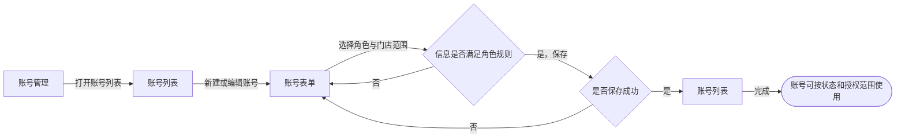
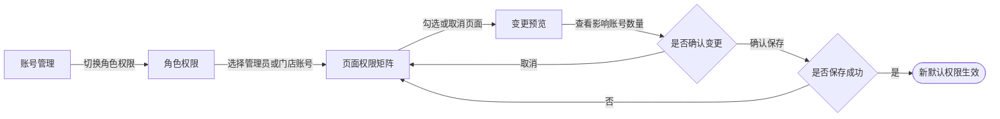
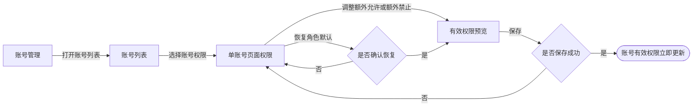
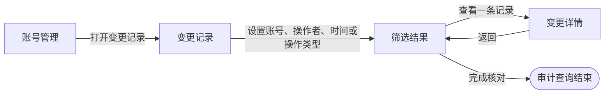

# 用户流程 - dy-data（DYDATA-32 账号权限配置）

> 生成时间: 2026-07-20
> Skill: page-explainer
> 状态: 已于 2026-07-20 经用户确认
> 范围: `/admin/accounts`；描述已确认的 DYDATA-32 用户任务，不把尚未实现的入口写成现有能力

本文件只描述用户流程语义。产物索引、存在性校验和一致性自查统一在最终的 `explainer-delivery-dy-data.md` 中收束。

## 用户流程

### 流程 1：维护账号及门店范围

**用户角色**：最高管理员；管理员仅管理门店账号

**目标**：创建或编辑账号，并为账号设置符合角色边界的门店范围。

#### 流程图

#### 步骤明细

| 步骤 | 页面 | 路由 | 用户动作 | 结果 |
|---|---|---|---|---|
| 1 | 账号管理 | `/admin/accounts` | 打开“账号列表” | 查看账号、角色、状态、门店范围和继承状态 |
| 2 | 账号管理 | `/admin/accounts` | 新建账号或编辑已有账号 | 打开账号表单 |
| 3 | 账号管理 | `/admin/accounts` | 设置角色、状态和门店范围 | 页面按角色规则校验；门店账号和受限管理员不得保存空范围 |
| 4 | 账号管理 | `/admin/accounts` | 保存账号 | 成功后刷新账号列表；不满足规则时保留表单并提示修正 |

### 流程 2：配置角色默认页面权限

**用户角色**：最高管理员；管理员仅可配置门店账号默认权限

**目标**：在同一账号管理页面中，按“角色 × 当前已登记页面”修改默认页面权限。

#### 流程图

#### 步骤明细

| 步骤 | 页面 | 路由 | 用户动作 | 结果 |
|---|---|---|---|---|
| 1 | 账号管理 | `/admin/accounts` | 切换到“角色权限” | 查看最高管理员、管理员和门店账号三类角色及当前登记页面 |
| 2 | 账号管理 | `/admin/accounts` | 调整管理员或门店账号的默认页面权限 | 最高管理员保持只读全选；页面记录待保存变更 |
| 3 | 账号管理 | `/admin/accounts` | 点击保存 | 查看变更内容、继承账号数量和自定义账号处理说明 |
| 4 | 账号管理 | `/admin/accounts` | 确认变更 | 继承账号采用新默认；自定义账号保持原有效权限并重新计算差异 |

### 流程 3：配置单账号差异权限

**用户角色**：最高管理员；管理员仅可配置门店账号

**目标**：在角色默认权限基础上，为一个账号增加允许项、增加禁止项，或恢复角色默认权限。

#### 流程图

#### 步骤明细

| 步骤 | 页面 | 路由 | 用户动作 | 结果 |
|---|---|---|---|---|
| 1 | 账号管理 | `/admin/accounts` | 在账号列表选择“页面权限” | 查看角色默认权限、账号差异和最终有效权限 |
| 2 | 账号管理 | `/admin/accounts` | 设置额外允许或额外禁止 | 页面即时展示最终有效权限 |
| 3 | 账号管理 | `/admin/accounts` | 选择“恢复角色默认权限”并确认 | 清除该账号差异，重新继承角色默认权限 |
| 4 | 账号管理 | `/admin/accounts` | 保存 | 权限立即生效，账号旧会话失效或重新校验 |

### 流程 4：查看账号与权限变更记录

**用户角色**：最高管理员；管理员只能查看门店账号相关记录

**目标**：从账号管理页进入变更记录，筛选并核对账号、权限、门店范围和密码重置事件。

#### 流程图

#### 步骤明细

| 步骤 | 页面 | 路由 | 用户动作 | 结果 |
|---|---|---|---|---|
| 1 | 账号管理 | `/admin/accounts` | 点击“变更记录”入口 | 在账号管理上下文内打开记录列表，不新增第三个页签 |
| 2 | 账号管理 | `/admin/accounts` | 按账号、操作者、时间或操作类型筛选 | 查看符合自身审计范围的记录 |
| 3 | 账号管理 | `/admin/accounts` | 查看记录详情 | 查看操作者、操作时角色、对象、时间、变更前后和执行结果；不显示密码、token 或 cookie |

## 流程断点

| 编号 | 当前运行页面事实 | 对上述流程的影响 | 初步分类 |
|---|---|---|---|
| F-GAP-01 | 当前角色选项为“门店账号、全局查看、最高管理员” | 与已确认的“最高管理员、管理员、门店账号”不一致 | `logic_conflict`，待 Phase 3 形成正式差异条目 |
| F-GAP-02 | 当前没有“账号列表 / 角色权限”两个页签 | 流程 2 无入口 | `design_gap`，待 Phase 3 形成正式差异条目 |
| F-GAP-03 | 当前没有单账号差异权限和恢复默认入口 | 流程 3 无入口 | `design_gap`，待 Phase 3 形成正式差异条目 |
| F-GAP-04 | 当前没有权限变更记录入口 | 流程 4 无入口 | `design_gap`，待 Phase 3 形成正式差异条目 |
