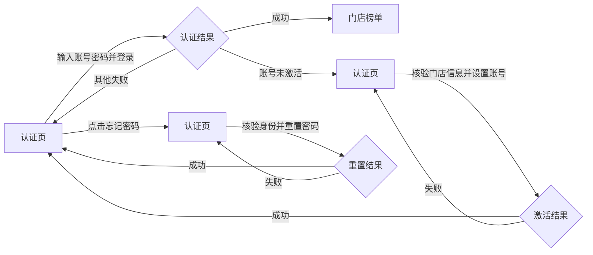
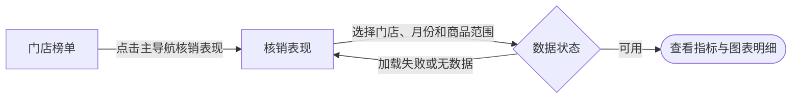
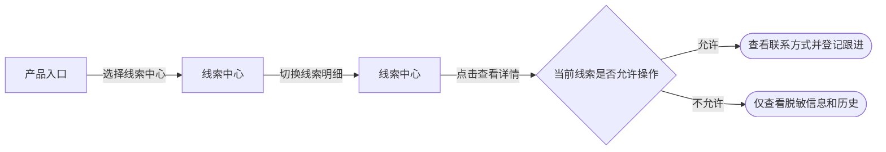
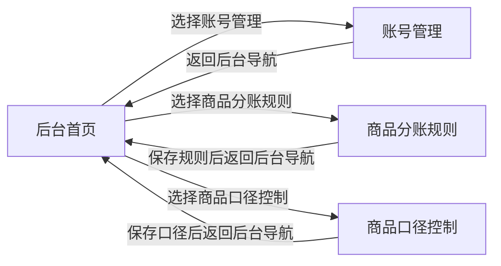
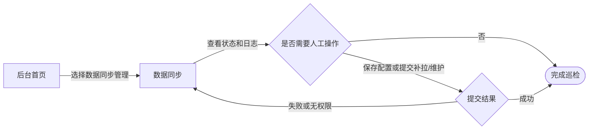
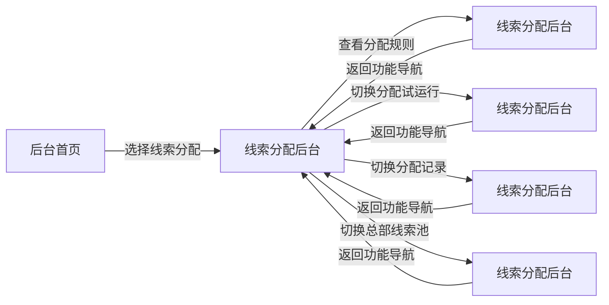
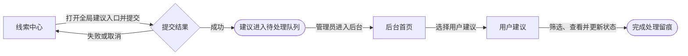

# 用户流程 - dy-data（抖音经营数据引擎）

> 生成时间: 2026-07-19 17:23 +08:00
> Skill: page-explainer
> 阶段: Phase 2 - 流程梳理

> 本文件只描述用户流程语义。产物索引、存在性校验、一致性自查统一在后续 `explainer-delivery-dy-data.md` 收束。

## 使用边界

- 本文件以当前可运行版本为准。非线索页面后续若由协作者修改，需要同步刷新对应流程和逐页说明。
- 单店、多店、区域和全国是同一套页面内的数据权限范围，不拆成独立产品端。
- 线索中心只记录当前已经存在的看板、明细、详情和跟进入口；新分配规则、总部池流转和旧引擎退役的最终业务语义由 `DYDATA-36` 线索中心 BRD V1.0 固化。
- 后台入口当前只向 `admin` 角色展示；最高管理员与普通管理员的写入边界在 Phase 3 使用本地角色 mock 验证，最终权限改造归属 `DYDATA-32`。
- 2026-07-20 需求方确认全部现有页面内容作为当前版本基线，8 条流程均为 `locked`。流程 2、3 只冻结为“当前版本历史基线”，不代表协作者改造后的最终需求；新版合入后必须重新验证。
- 线索分配流程只冻结当前页面导航，不冻结 `DYDATA-36` 尚未定义的业务规则。

## 用户流程

### 流程 1: 登录、账号激活与密码恢复

**用户角色**: 所有已授权系统用户

**目标**: 使用系统账号进入业务页面，或在无法登录时完成密码重置、账号激活

**确认状态**: `locked`

#### 流程图

#### 步骤明细

| 步骤 | 页面 | 路由 | 用户动作 | 结果 |
|------|------|------|---------|------|
| 1 | 认证页 | `/login` | 输入账号名和密码并登录 | 成功后进入门店榜单；失败时停留并显示原因 |
| 2 | 认证页 | `/auth/reset-password` | 从“忘记密码”进入，核验身份并设置新密码 | 成功后返回登录；失败时保留在重置流程 |
| 3 | 认证页 | `/auth/activate` | 核验门店信息，设置登录账号和密码 | 成功后返回登录；失败时保留在激活流程 |
| 4 | 门店榜单 | `/ranking` | 登录成功后接收系统跳转 | 进入已授权业务工作区 |

### 流程 2: 复核门店分佣与订单明细

**用户角色**: 集团财务、经销商财务、经销商抖音负责人、多店/区域/总部管理人员

**目标**: 从门店横向表现下钻到单店分账，再追溯具体订单

**确认状态**: `locked`（仅作为当前版本历史基线；协作者新版合入后重新验证）

#### 流程图

#### 步骤明细

| 步骤 | 页面 | 路由 | 用户动作 | 结果 |
|------|------|------|---------|------|
| 1 | 产品入口 | `/` | 选择“订单分佣结算中心” | 进入门店榜单 |
| 2 | 门店榜单 | `/ranking` | 选择月份、产品范围、商品类型并点击门店行 | 将筛选条件和门店带入单店分账 |
| 3 | 单店分账 | `/settlement` | 查看应收、应付和不参与分佣数据，点击指标或表格行 | 将关系类型、门店、月份等条件带入订单明细 |
| 4 | 订单明细 | `/details` | 复核订单字段、调整筛选或导出当前账号可见结果 | 完成订单级追溯 |

### 流程 3: 查看核销表现

**用户角色**: 经销商抖音负责人、多店/区域/总部管理人员及其他授权查看用户

**目标**: 在权限范围内查看销售、核销、周期和门店分布表现

**确认状态**: `locked`（仅作为当前版本历史基线；协作者新版合入后重新验证）

#### 流程图

#### 步骤明细

| 步骤 | 页面 | 路由 | 用户动作 | 结果 |
|------|------|------|---------|------|
| 1 | 门店榜单 | `/ranking` | 从主模块导航进入“核销表现” | 切换到核销分析工作区 |
| 2 | 核销表现 | `/sales` | 按门店、月份、产品范围和商品类型筛选，查看或点击图表数据点 | 数据可用时展示指标和图表明细；失败时留在当前页并显示资源状态 |

### 流程 4: 查看并处理门店线索

**用户角色**: 经销商客服、经销商抖音负责人、多店/区域/总部管理人员

**目标**: 查看权限范围内的线索表现，定位具体线索并在允许时登记跟进

**确认状态**: `locked`（仅冻结当前查看与跟进路径；分配与失效业务语义等待 `DYDATA-36`）

#### 流程图

#### 步骤明细

| 步骤 | 页面 | 路由 | 用户动作 | 结果 |
|------|------|------|---------|------|
| 1 | 产品入口 | `/` | 选择“线索中心” | 进入经营线索概览 |
| 2 | 线索中心 | `/clues` | 按权限范围筛选并查看线索指标，切换到“线索明细” | 进入线索跟进列表 |
| 3 | 线索中心 | `/clues/details` | 筛选明细并点击“查看详情” | 在当前页面打开线索跟进详情浮层 |
| 4 | 线索中心 | `/clues/details` | 查看商品订单、分配轮次和跟进历史；当前实现允许时查看/复制号码并保存跟进 | 可操作线索产生跟进记录；不可操作线索仅保留脱敏查看能力 |

### 流程 5: 管理账号与经营口径

**用户角色**: 授权后台管理员

**目标**: 从后台首页进入账号、分佣规则和商品口径配置

**确认状态**: `locked`（当前页面路径已确认；普通管理员写权限等待 `DYDATA-32`）

#### 流程图

#### 步骤明细

| 步骤 | 页面 | 路由 | 用户动作 | 结果 |
|------|------|------|---------|------|
| 1 | 后台首页 | `/admin` | 从后台模块卡片或二级导航选择配置模块 | 进入目标后台页面 |
| 2 | 账号管理 | `/admin/accounts` | 查看账号；有权限时创建、编辑、启停或重置账号 | 账号及门店范围被保存，或页面给出校验/权限结果 |
| 3 | 商品分账规则 | `/admin/rules` | 查询并预选 SKU，维护分账规则或不分佣账号 | 保存后触发当前实现中的后台结算重建 |
| 4 | 商品口径控制 | `/admin/product-types` | 维护系统可见商品类型和默认范围 | 保存后影响线索与结算页面展示口径 |

### 流程 6: 维护数据同步与线索中心物化

**用户角色**: 授权后台管理员；写操作按最高管理员权限控制

**目标**: 查看同步运行情况，配置采集节奏，按需补拉或维护线索中心数据

**确认状态**: `locked`（当前页面路径已确认；角色写权限等待 Phase 3 mock 与 `DYDATA-32`）

#### 流程图

#### 步骤明细

| 步骤 | 页面 | 路由 | 用户动作 | 结果 |
|------|------|------|---------|------|
| 1 | 后台首页 | `/admin` | 选择“数据同步管理” | 进入同步工作台 |
| 2 | 数据同步 | `/admin/sync` | 查看后台状态、当前任务、同步配置和日志 | 判断是否需要人工处理 |
| 3 | 数据同步 | `/admin/sync` | 有权限时保存配置、提交手动补拉或执行线索中心维护 | 成功后产生状态/任务反馈；失败或无权限时留在当前页说明原因 |

### 流程 7: 管理当前线索分配工作台

**用户角色**: 授权后台管理员；普通管理员按已确认方向只读

**目标**: 在同一后台工作台查看规则、试运行、分配记录和总部线索池

**确认状态**: `locked`（仅冻结四个当前子视图的导航；规则和总部池业务语义仍归 `DYDATA-36`）

#### 流程图

#### 步骤明细

| 步骤 | 页面 | 路由 | 用户动作 | 结果 |
|------|------|------|---------|------|
| 1 | 后台首页 | `/admin` | 选择“线索分配” | 进入线索分配工作台 |
| 2 | 线索分配后台 | `/admin/clue-allocation/rules` | 查看当前规则范围和版本 | 当前页面结构可用；规则业务含义不在本文件锁定 |
| 3 | 线索分配后台 | `/admin/clue-allocation/trial` | 切换到分配试运行 | 查看当前试运行入口和记录；执行语义等待专项 BRD |
| 4 | 线索分配后台 | `/admin/clue-allocation/records` | 切换到分配记录 | 查看当前分配与审计记录 |
| 5 | 线索分配后台 | `/admin/clue-allocation/headquarters` | 筛选并查看总部线索池 | 查看当前总部池库存；再投放与闭环规则等待专项 BRD |

### 流程 8: 提交并处理用户建议

**用户角色**: 所有已登录用户提交；授权后台管理员查看和处理

**目标**: 从业务页面提交体验或数据问题，并由后台人员跟踪处理状态

**确认状态**: `locked`

#### 流程图

#### 步骤明细

| 步骤 | 页面 | 路由 | 用户动作 | 结果 |
|------|------|------|---------|------|
| 1 | 线索中心 | `/clues` | 使用 Shell 全局“建议”入口填写类型、内容和可选联系方式 | 成功后进入待处理队列；失败或取消时仍留在原业务页。该入口同样存在于其他 Shell 页面 |
| 2 | 后台首页 | `/admin` | 管理员选择“用户建议” | 进入反馈管理页面 |
| 3 | 用户建议 | `/admin/feedback` | 按类型、状态、日期等条件筛选，查看详情并更新处理状态 | 建议处理过程形成可查询状态 |

## 流程断点与待确认项

| 项目 | 当前结论 | 后续动作 |
|------|---------|---------|
| 14 个页面组件和路由 | 均存在，当前运行版可到达 | Phase 3 逐页说明时继续核对控件、状态和异常分支 |
| 登录成功分支 | 代码明确成功后跳转 `/ranking`；本轮未使用真实账号提交登录 | Phase 3 使用本地角色 mock 覆盖登录后角色路径 |
| 角色和组织范围 | BRD 已锁定同页分层可见；后台入口已有 `admin` 门禁 | 使用门店、普通管理员、最高管理员 mock 验证；写权限以 `DYDATA-32` 为准 |
| 线索查看与跟进 | `/clues`、`/clues/details` 和详情浮层运行路径已验证 | Phase 3 说明当前控件，不扩写未确认分配语义 |
| 线索分配与总部池 | 四个子视图均可到达，但新规则与总部池闭环尚未形成专项 BRD | 保持 `open-DYDATA-36`，不得在 PAGE_EXPLAINER 中自行定稿 |
| 结算中心协作改造 | 当前运行版已经完成浏览器验证，但业务需求与现版变化较大 | 流程 2、3 只作为历史基线锁定；协作者版本合入后重新执行浏览器核验并覆盖旧口径 |
| 非线索页面后续协作改动 | 本文件按 2026-07-19 当前版本记录 | 页面改动合并后重新执行对应流程核验 |

## 浏览器验证摘要

- 演示运行时: `http://127.0.0.1:4175/`，使用 530 条本地合成线索，不写数据库。
- 已通过页面点击验证：产品入口 → 线索看板 → 线索明细 → 跟进详情浮层。
- 已通过页面点击验证：门店榜单 → 单店分账 → 订单明细，并确认筛选参数随跳转传递。
- 已通过页面点击验证：核销表现、后台首页、账号管理、商品分账规则、商品口径控制、用户建议、数据同步。
- 已通过页面点击验证：线索分配工作台 → 总部线索池；其他子视图路由与功能导航同时存在。
- 未登录运行时: `http://127.0.0.1:4176/`；已验证登录、重置密码、账号激活三种认证页面。
