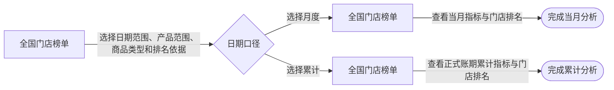
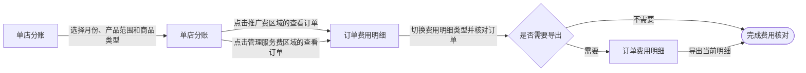
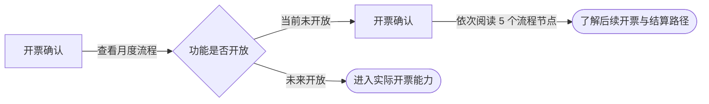

# 用户流程 - 抖音经营数据引擎（门店结算）

> 生成时间: 2026-07-17 14:36
> Skill: page-explainer
> 状态: locked（依据 DYDATA-23 已确认四页基线及 2026-07-17 浏览器复核）

> 本文件只描述用户流程语义。产物索引、存在性校验、一致性自查统一在 `explainer-delivery-dy-data.md`。

## 用户流程

### 流程 1: 查看全国门店销售与结算排名

**用户角色**: 业务总部运营人员
**目标**: 按月度或累计口径，对全国门店的销售、核销与厂端结算表现进行筛选和比较。

#### 流程图

#### 步骤明细

| 步骤 | 页面 | 路由 | 用户动作 | 结果 |
|------|------|------|---------|------|
| 1 | 全国门店榜单 | `#/ranking` | 选择日期范围、产品范围、商品类型、门店搜索与排名依据 | 指标卡和排名表按筛选条件刷新 |
| 2 | 全国门店榜单 | `#/ranking` | 选择“月度” | 查看所选月份的全国门店销售、核销与厂端结算表现 |
| 3 | 全国门店榜单 | `#/ranking` | 选择“累计” | 标题、累计口径说明与门店数量徽标联动，累计从正式账期开始计算 |

### 流程 2: 从单店分账核对订单级费用

**用户角色**: 门店经营或财务人员
**目标**: 查看本店月度推广费、管理服务费，再带着当前筛选上下文下钻订单明细进行核对。

#### 流程图

#### 步骤明细

| 步骤 | 页面 | 路由 | 用户动作 | 结果 |
|------|------|------|---------|------|
| 1 | 单店分账 | `#/store` | 选择月份、产品范围和商品类型 | 五项门店指标、推广费表和管理服务费表按条件展示 |
| 2 | 单店分账 | `#/store` | 在目标费用行点击“查看订单” | 跳转订单费用明细并携带月份、门店、产品范围、商品类型、费用方向、比例、规则版本与工作台焦点 |
| 3 | 订单费用明细 | `#/orders` | 切换“推广费订单明细 / 管理服务费订单明细” | 标题、比例与订单行同步切换 |
| 4 | 订单费用明细 | `#/orders` | 调整核销月份、数据状态或订单搜索 | 当前订单列表按筛选条件刷新 |
| 5 | 订单费用明细 | `#/orders` | 点击“导出当前明细”（可选） | 导出当前筛选口径的订单费用明细 |

### 流程 3: 查看账单确认与开票路径

**用户角色**: 门店经营或财务人员
**目标**: 了解月度账单确认、开票、财务审核与结算的完整顺序及当前能力边界。

#### 流程图

#### 步骤明细

| 步骤 | 页面 | 路由 | 用户动作 | 结果 |
|------|------|------|---------|------|
| 1 | 开票确认 | `#/invoice` | 打开页面 | 看到“当前功能暂未开放”状态，避免误认为可以在线开票 |
| 2 | 开票确认 | `#/invoice` | 依次阅读 5 个流程节点 | 了解账单生成、门店确认、开具推广费发票、财务审核和进入结算的顺序 |
| 3 | 开票确认 | `#/invoice` | 查看后续说明 | 当前版本停留在说明与引导层，不进入发票 API 或财务操作 |

## 流程断点与边界

- 全国门店榜单当前原型没有通过门店表格行进入指定门店分账的交互；四页之间通过固定导航切换，生产实现不应虚构总部可访问任意门店账单的权限。
- 订单导出在原型中只有按钮语义，真实导出文件格式、权限、失败反馈和审计要求应由 DYDATA-33 的生产契约约束。
- 开票确认当前明确为未开放引导页；“未来开放”分支不是本轮实现范围。
- 最新 DYDATA-31 与已确认原型存在一处费用范围口径差异，需在交互语义阶段形成 gap 并按最新需求修正。
